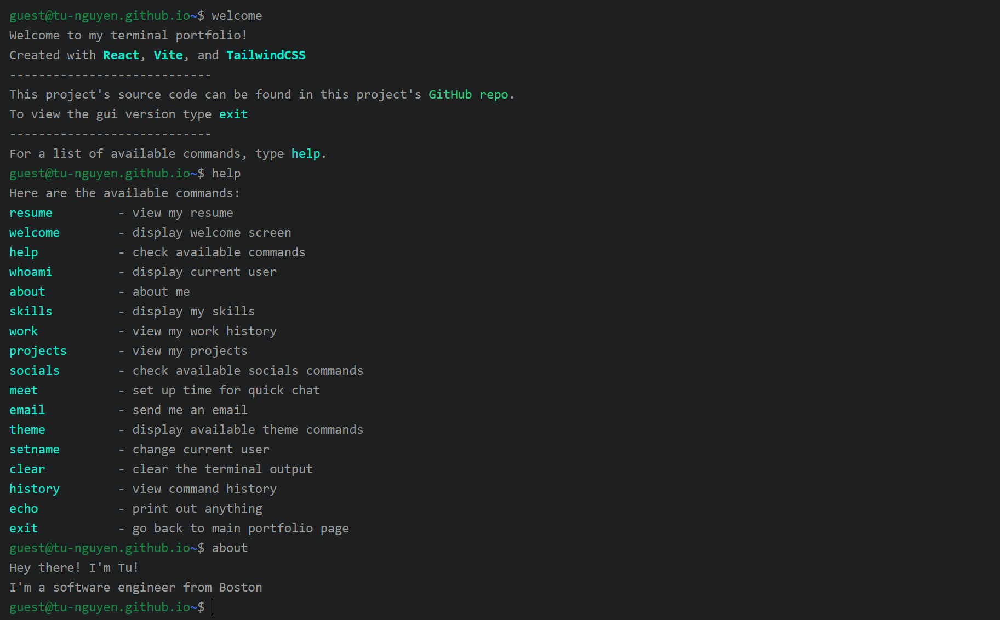

# terminal-portfolio



<!-- - [@vitejs/plugin-react](https://github.com/vitejs/vite-plugin-react/blob/main/packages/plugin-react/README.md) uses [Babel](https://babeljs.io/) for Fast Refresh
- [@vitejs/plugin-react-swc](https://github.com/vitejs/vite-plugin-react-swc) uses [SWC](https://swc.rs/) for Fast Refresh -->

## About

My terminal styled potfolio website in terminal made with React, TypeScript, Vite, and Tailwind CSS. 

Live: [Deployed via Github Pages](https://tu-nguyen.github.io/terminal-portfolio/)

## Installation

```bash
git clone https://github.com/tu-nguyen/terminal-portfolio.git
cd terminal-portfolio
npm install
```

## Usage

To run the development server:

```bash
npm run dev
```

Once configs updated, to deploy the project on Github:

```bash
npm run build
```

## Technologies Used

1. React

2. Vite

3. TypeScript

4. Tailwind CSS
